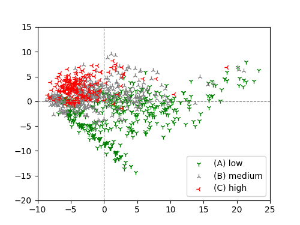

# Representation of Solubility of Small Molecules

## Introduction

*Small molecules* are still a large percentage of *drug discovery* candidate substances due to their ease of handling and use. In drug discovery involving small molecules, there is a process called *screening* that selects drug candidate compounds in the initial steps from a vast number of chemical structures to be investigated. *Virtual screening* is a method that accelerates this process by computing.

In early virtual screening, *molecular descriptors* based on chemical structures were often used to characterize small molecule drugs. For example, one of such attempts is the *rule of five*, which is a criterion proposed by *Lipinski et al.* in 1997 to evaluate absorption and permeation of a chemical compound[^Lipinski]. 

Here, as a simple example of charcterize small molecules by molecular descriptors, we take the *solubility* of a chemical compound as the target index and project the molecular descriptors of each compound by *principal component analysis*, PCA, to visually represent that the compounds can be classified by the index.

## Dataset

We use the dataset from [^Huuskonen], which evaluates the solubility of small molecules. This dataset contains 1,025 small molecules of organic compounds defined in the `MDL Molfile` format, with 417, 402, and 206 chemical compounds classified for low, medium, and high solubility, respectively.

The Python *cheminformatics* package `RDKit` was used to calculate molecular descriptors. Among all molecular descriptors defined in `RDKit`, 183 molecular descriptors were used as *features*, excluding descriptors that contain missing values or have zero variance. Thus, each compound is represented by a real vector of 183 dimensions and the dataset is a $(1025 \times 183)$-matrix.

## Projection and Classification

PCA is a linear method that gives a projection from the original coordinates to the coordinates that maximize the variance in each dimension, and is one of the most fundamental methods of *unsupervised learning*. It is often used as the first choice in *machine learning*, especially for *visualization*, because it allows dimensionality reduction at a practical cost from a given dataset in high dimensions.

Here, we project the representation of compounds by high-dimensional molecular descriptors to the coordinate with the largest variance using PCA and investigate the possibility of classification by solubility labels. We performed PCA on the matrix of the given dataset and plotted the results by the two dimensions with the largest variance in Figure 1.

**Figure 1. Relationship between the PCA projection of molecular descriptors of small molecules and solubility.**

Compounds with high, medium, and low solubilities form a cluster in the projected space, respectively. Among these, especially for compounds with high and low solubility, we can see that almost linear separation is possible by the two variables from the order of large variance. On the other hand, it would be necessary to try more variables or classification methods to classify the clusters with medium solubility.

[^Lipinski] C.A. Lipinski, et al., *Experimental and computational approaches to estimate solubility and permeability in drug discovery and development settings*, **Adv Drug Deliv Rev**, 23, pp.3-25, 1997.
[^Huuskonen] J. Huuskonen, *Estimation of Aqueous Solubility for a Diverse Set of Organic Compounds Based on Molecular Topology*, **J Chem Inf Comput Sci**, 40, 3, pp.773–777, 2000.
